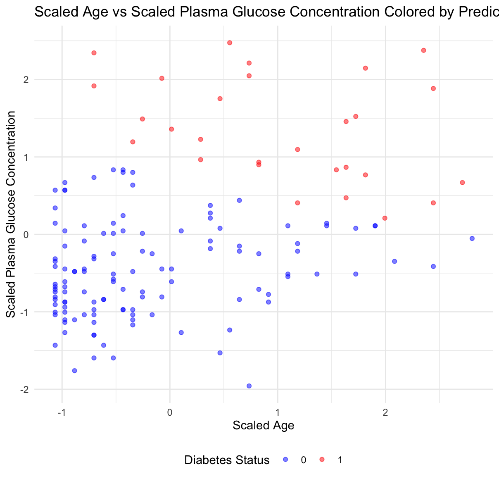
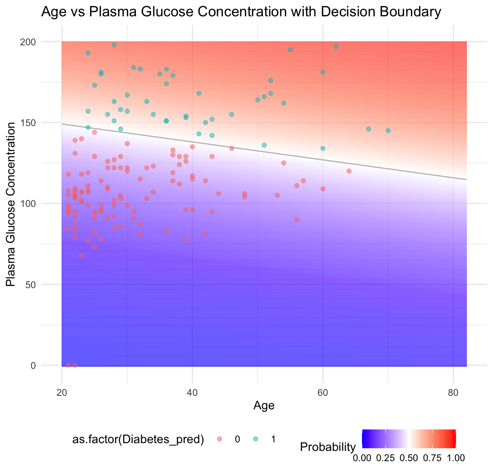
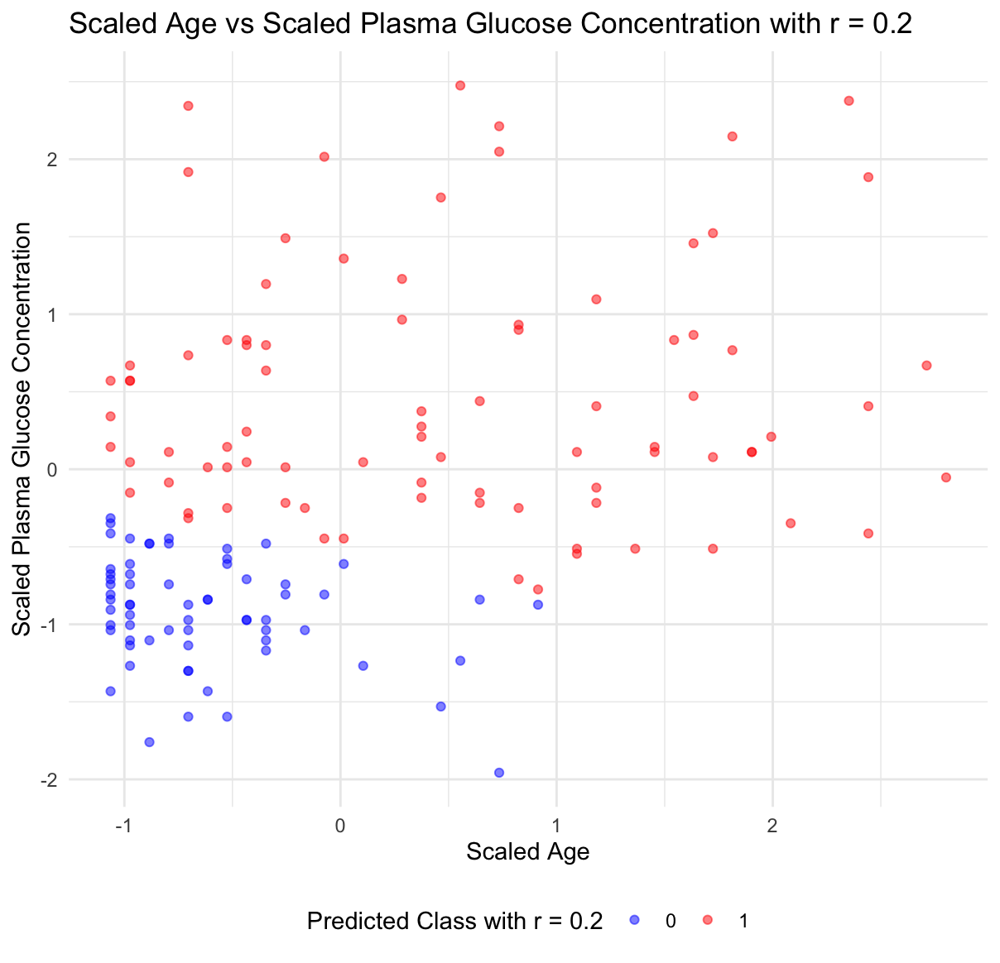
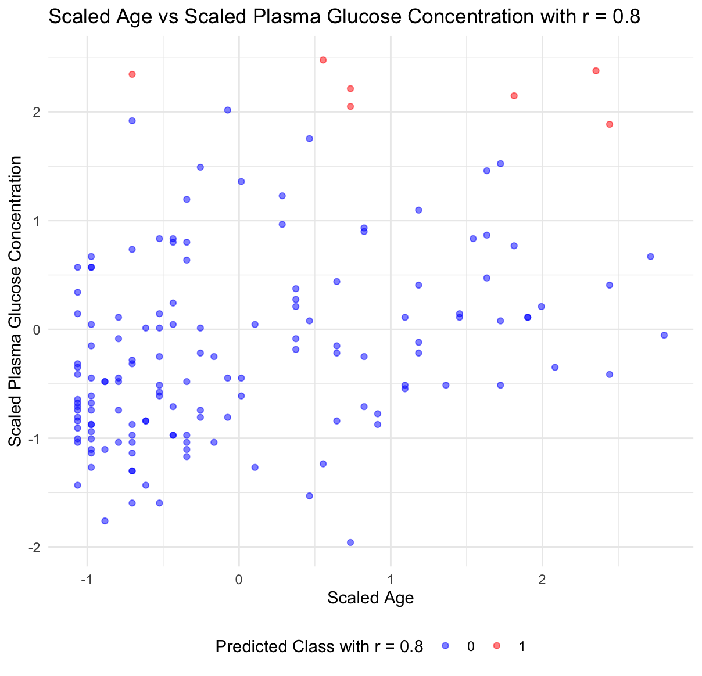
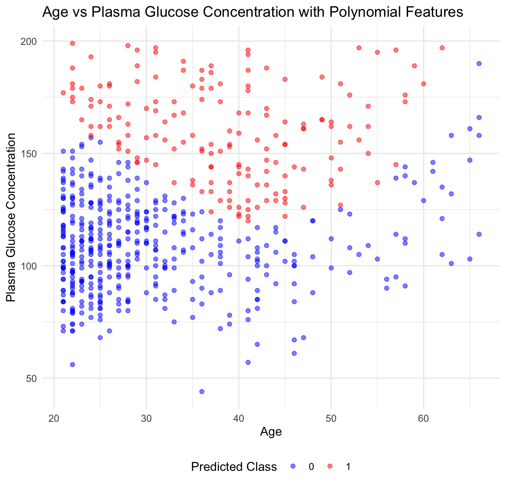

# Assignment 3

###### [Previous Problem]


###### [ChangeLog]

* corrected x/y axis to increase readability
* since step2, data is preprocessed by outlier removal, feature scaling. The MSE slightly dwindled 3% to 22.7% in Step 2.
* Step 4, 5 derives preprocessed data from Step 2. In 3.5 MSE increased 2% to 25.3%

###### [Step 1]

1. I do not directly consider the standard logistic regression is a proper method to classify the diabetes.

* it appears no clear linear boundary could easily seperate the two classes($\color{blue}{No ~Diabete}/\color{red}{Diabetes}$). The standard logistic regression relies on a linear decision boundary, which is  not applicable to draw a clear and satisfiable one from the figure.
* Around the plasma glucose concentration range of 100, it shows high density of both classes distribution. There is a significant overlap in the feature space, which enhances the difficulty for the model to differentiate between classes.
* On the right part of the figure, some $\color{blue}{outliers}$ may skew the decision boundary and lessen the accuracy of model.
* This figure doesn't show a distinct linear relationship. Thus the model requires to be modified.


###### [Step 2]

2. From the computation, we got the equation below:

   $$
   p = \frac{1}{1 + e^{-( -5.849089 + 0.020231  x_1 + 0.020231  x_2 )}}
   $$

   The summary of the model is:

   ```
   glm(formula = Diabetes ~ Age + Plasma_glucose_concentration, 
       family = "binomial", data = train_data)

   Coefficients:
                                 Estimate Std. Error z value Pr(>|z|)  
   (Intercept)                  -5.849089   0.517548 -11.302   <2e-16 ***
   Age                           0.020231   0.008121   2.491   0.0127 *  
   Plasma_glucose_concentration  0.020231   0.003735   9.777   <2e-16 ***
   ---
   Signif. codes:  0 ‘***’ 0.001 ‘**’ 0.01 ‘*’ 0.05 ‘.’ 0.1 ‘ ’ 1

   (Dispersion parameter for binomial family taken to be 1)

       Null deviance: 796.05  on 614  degrees of freedom
   Residual deviance: 641.81  on 612  degrees of freedom
   AIC: 647.81

   Number of Fisher Scoring iterations: 4
   ```

   And the misclassification rate is $0.226667\approx22.7\%$

   Th e quality of classification is thus moderate.



###### [Step 3]

3. Given $r=0.5$ in step 2, We may compute this equation as ,

   $$
   0.5 = \frac{1}{1 + e^{-( -5.849089 + 0.02023 x_1 + 0.020231  x_2 )}}\\
   \\


    x_2=0.118333-0.020231x_1
   $$

   So we got the black line below as decision boundary. And the color of background shows the probability distribution, while the dots indicate the position of samples.



###### [Step 4]

4. These two figures below shows how the r=0.2 and 0.8 would look like, different from 0.5 as step 2,3. Changing the threashold affects the sensitivity and specificity of the model.

   * Lowering the threshold (r = 0.2) increases sensitivity, meaning the model identifies more true positives but also more false positives.
   * Raising the threshold (r = 0.8) increases specificity, meaning the model identifies fewer false positives but also fewer true positives.

   The $r$ here is a hyperparameter, which means its value is set before the learning process begins. The best threshold is often determined empirically. It is sort of trade-offs about how much people are willing to make between different types of errors(_False positives_ and _False negatives_)





###### [Step 5]

5. By adding some polynomial features, the model now can account for non-linear interactions between features. This allows a decision boundary not having to be a straight line. Ths misclassification rate is $25.3311\%$. While the decision boundary becomes clear, we ought to remind ourselves of overfitting pitfall, which may not generalize well to unseen data.


