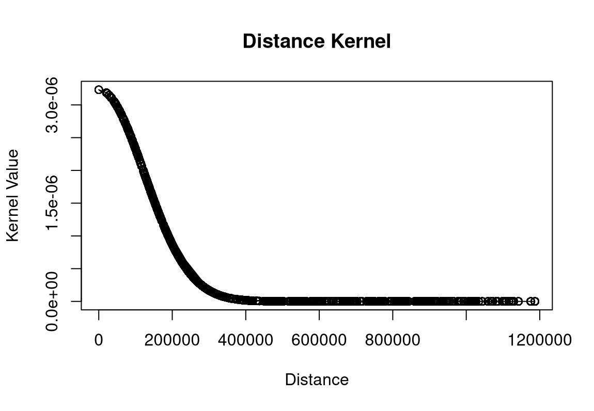
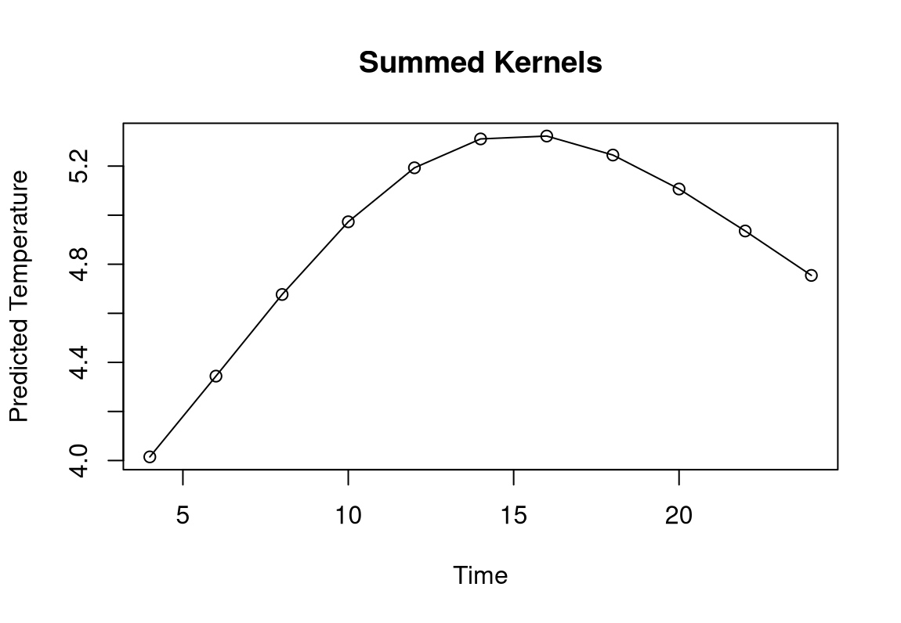
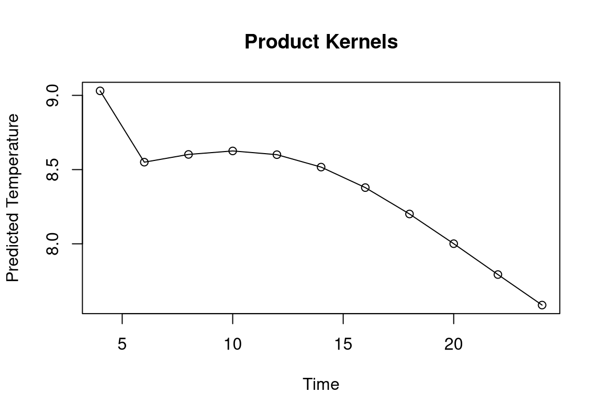

# Lab3 Report 

## Assignment 1

From the instruction, there are two types of kernel, **Sum** and **Multiply**. 

### Kernels

* Gaussian kernel

    $$
    K(x, h) = \frac{1}{h\sqrt{2\pi}} e^{-\frac{x^2}{2h^2}}
    $$

* Distance kernel

	$$
  K_{\text{distance}}(d) = \frac{1}{h_{\text{distance}}\sqrt{2\pi}} e^{-\frac{d^2}{2h_{\text{distance}}^2}}
  $$

*  Date kernel
    $$
  K_{\text{date}}(\Delta \text{days}) = \frac{1}{h_{\text{date}}\sqrt{2\pi}} e^{-\frac{\Delta \text{days}^2}{2h_{\text{date}}^2}}
  $$
*  Time kernel
  $$
  K_{\text{time}}(\Delta \text{hours}) = \frac{1}{h_{\text{time}}\sqrt{2\pi}} e^{-\frac{\Delta \text{hours}^2}{2h_{\text{time}}^2}}
  $$

* Summation kernel
  $$
  K_{\text{sum}} = K_{\text{distance}} + K_{\text{date}} + K_{\text{time}}
  $$
  

* Multiplication kernel
  $$
  K_{\text{product}} = K_{\text{distance}} \times K_{\text{date}} \times K_{\text{time}} 
  $$
  

### Figures

### Result 

This table shows digital different between two kernels, for predicting weather on the day `2013-11-04`.

| Time  | Summed_Kernel_Prediction | Multiplied_Kernel_Prediction | Difference |
| ----- | ------------------------ | ---------------------------- | ---------- |
| 04:00 | 4.014787                 | 9.030418                     | -5.015632  |
| 06:00 | 4.343977                 | 8.549968                     | -4.205991  |
| 08:00 | 4.676713                 | 8.602079                     | -3.925367  |
| 10:00 | 4.973028                 | 8.625606                     | -3.652578  |
| 12:00 | 5.193100                 | 8.600511                     | -3.407411  |
| 14:00 | 5.310810                 | 8.516771                     | -3.205962  |
| 16:00 | 5.322462                 | 8.378694                     | -3.056232  |
| 18:00 | 5.245060                 | 8.200951                     | -2.955891  |
| 20:00 | 5.106609                 | 8.000868                     | -2.894258  |
| 22:00 | 4.935562                 | 7.792957                     | -2.857396  |
| 00:00 | 4.754427                 | 7.587342                     | -2.832915  |

And the reason why these two kernels differ:

|                  | Summation Kernel                                             | Multiplication Kernel                                        |
| ---------------- | ------------------------------------------------------------ | ------------------------------------------------------------ |
| Interactivity    | Each kernel contributes independently                        | All kernels must be aligned for impact                       |
| Sensitivity      | Less sensitive to individual low values                      | Highly sensitive to individual low values                    |
| Prediction curve | smoother transitions in predictions. For gradual and less abrupt changes. More possible to produce smooth curves | sharper, instant changes. For more localized prediction. Can produce a curve with peaks and troughs. |

